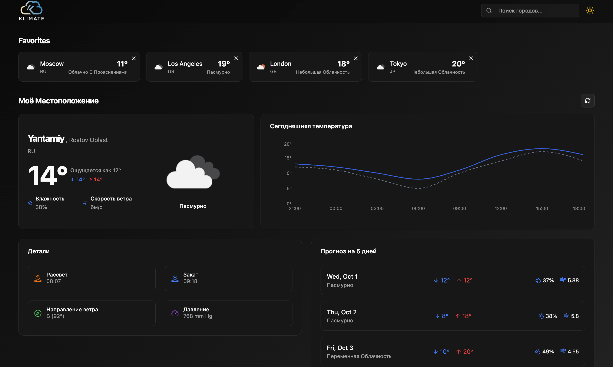
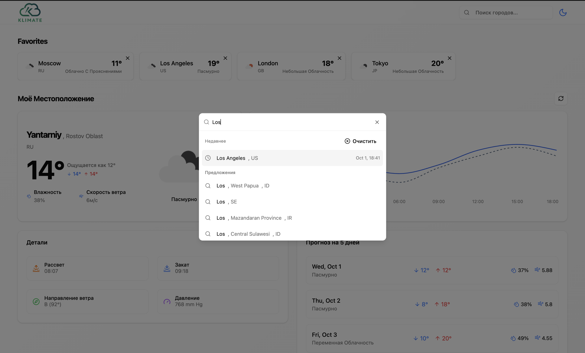
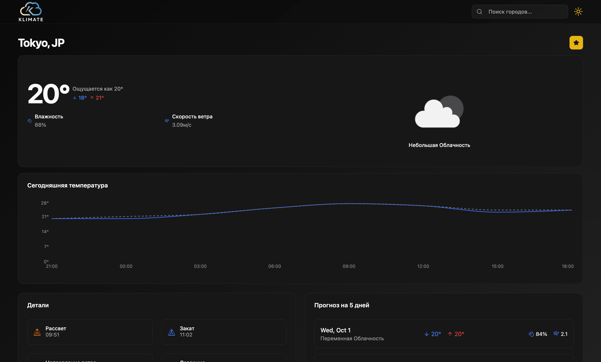

# 🌤️ Klimate

[](https://klimate-ecru.vercel.app/)


> Веб-сервис прогноза погоды с геолокацией и избранными городами.  
> Построен на **React + TypeScript + TailwindCSS** с использованием **TanStack Query**.

---

## 🚀 Demo
🔗 [Открыть проект на Vercel](https://klimate-ecru.vercel.app/)

---

## ✨ Features

- 🌍 Определение погоды по **текущей геолокации**
- 🔎 **Поиск городов** с автодополнением
- ⭐ Добавление городов в **избранное**
- 📊 Дэшборд с текущей погодой и прогнозом
- ⚡ Оптимизация запросов через **TanStack Query**

---

## 🛠️ Tech Stack

- **Frontend**: React, TypeScript, TailwindCSS, Shadcn/UI  
- **State/Query**: TanStack Query  
- **API**: [OpenWeather API]([https://www.weatherapi.com/](https://openweathermap.org/api)) (погода), [Geocoding API](https://openweathermap.org/api/geocoding-api) (геолокация)  
- **Deploy**: Vercel  

---

## 📸 Screenshots

| Главный экран | Поиск по городам | Страница города |
|---------------|------------------|-----------------|
|  |  | 

---

## ⚙️ Установка и запуск

```bash
# Клонировать проект
git clone https://github.com/yourusername/klimate.git

# Перейти в папку проекта
cd klimate

# Установить зависимости
npm install

# Запустить проект
npm run dev
````