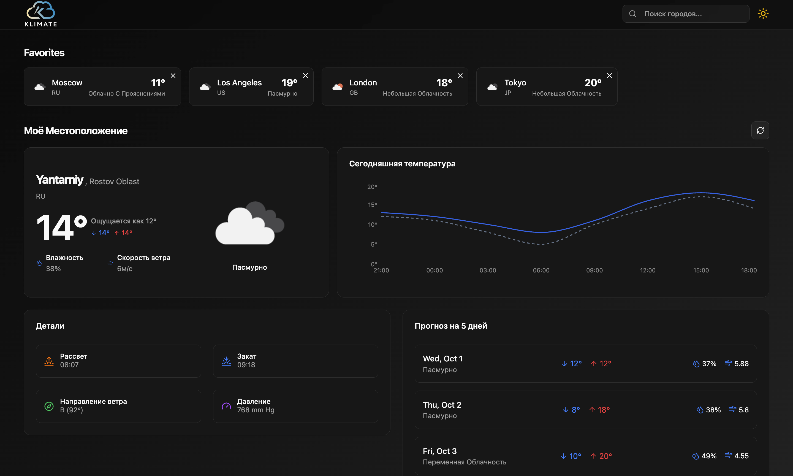
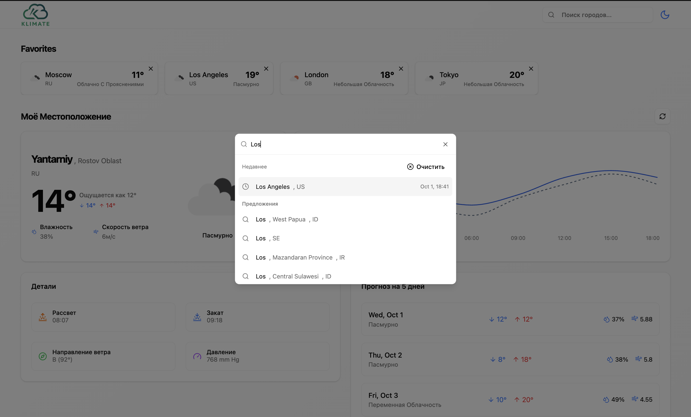
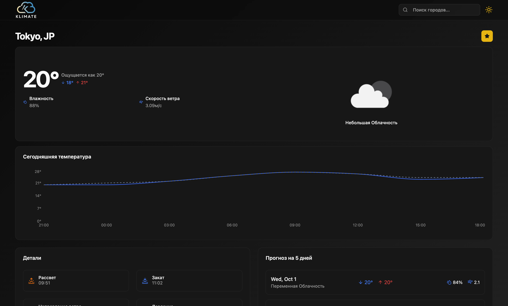

# Klimate

A client-side weather dashboard for checking local conditions, searching for cities, and keeping frequently viewed locations close at hand.

<p align="center">
  
  
  
  
  
  <a href="https://klimate-ecru.vercel.app/"></a>
</p>

## Preview

<p align="center">
  <a href="https://klimate-ecru.vercel.app/">
    
  </a>
</p>

<table>
  <tr>
    <td width="50%"></td>
    <td width="50%"></td>
  </tr>
  <tr>
    <td align="center">City search</td>
    <td align="center">City forecast</td>
  </tr>
</table>

## Overview

Klimate presents current conditions, an hourly temperature chart, and a five-day forecast using data from OpenWeather. It can use the browser's geolocation for local weather or open a dedicated forecast page for any city selected through search.

The application is entirely client-side. Weather data is managed as server state, while favorites, recent searches, and theme preference are stored locally in the browser.

## Features

- Current temperature, conditions, humidity, wind, pressure, sunrise, and sunset
- Hourly temperature and “feels like” visualization
- Five-day forecast with daily temperature ranges
- Browser geolocation with permission, unsupported-browser, and timeout handling
- Debounced city search with autocomplete and recent-search history
- Favorite cities with at-a-glance weather summaries
- Light and dark themes
- Responsive layouts for desktop and mobile screens

## Tech Stack

- **React 19 and TypeScript** — component UI with strict type checking
- **Vite** — development server and production build
- **TanStack Query** — request lifecycle, caching, retry policy, and cancellation
- **React Router** — dashboard and city forecast routes
- **Tailwind CSS and shadcn/ui** — styling and accessible UI primitives
- **Recharts** — hourly temperature chart
- **OpenWeather API** — current weather, forecast, and geocoding data
- **Vercel** — static deployment and SPA routing

## Technical Notes

- Weather, forecast, reverse-geocoding, and search requests use stable query keys based on coordinates or normalized search text.
- TanStack Query passes an `AbortSignal` to each request so obsolete searches and unmounted views can cancel in-flight work.
- Search input is debounced before calling the OpenWeather Geocoding API, reducing unnecessary requests while typing.
- API payloads and route coordinates are checked before they reach rendering code.
- Browser geolocation is used only for the current request and is not persisted. Favorite cities and search history are stored in `localStorage`.
- OpenWeather timestamps are displayed using the selected location's timezone offset.

## Getting Started

Requirements:

- Node.js 22
- An [OpenWeather API key](https://openweathermap.org/api)

```bash
git clone https://github.com/Teamofeyy/Klimate.git
cd Klimate
npm ci
cp .env.example .env.local
npm run dev
```

The development server will print the local URL after startup.

### Available Scripts

```bash
npm run dev      # Start the Vite development server
npm run lint     # Run ESLint
npm run build    # Type-check and create a production build
npm run preview  # Preview the production build locally
```

## Environment Variables

Create `.env.local` from the included `.env.example` and provide one variable:

```env
VITE_OPENWEATHER_API_KEY=your_openweather_api_key
```

Variables prefixed with `VITE_` are bundled into client-side JavaScript. The OpenWeather key is therefore public in a deployed build and must not be treated as a secret. Use a project-specific key and apply any restrictions supported by your OpenWeather account.

## Project Status

> Klimate is a completed pet project and is currently in maintenance-only mode. Its scope is intentionally small, and no major feature development is planned.
